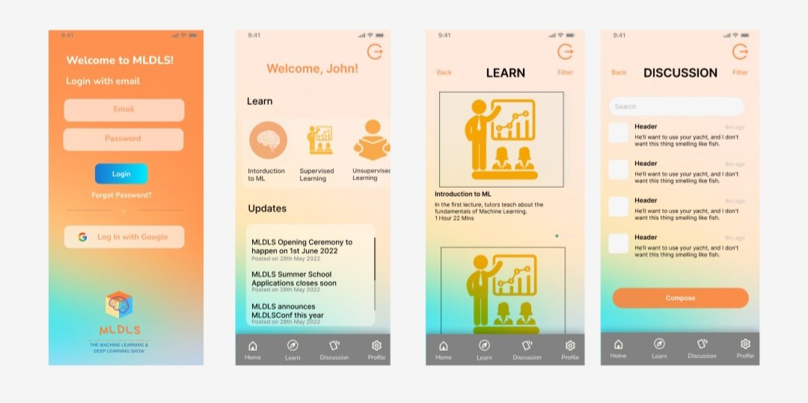
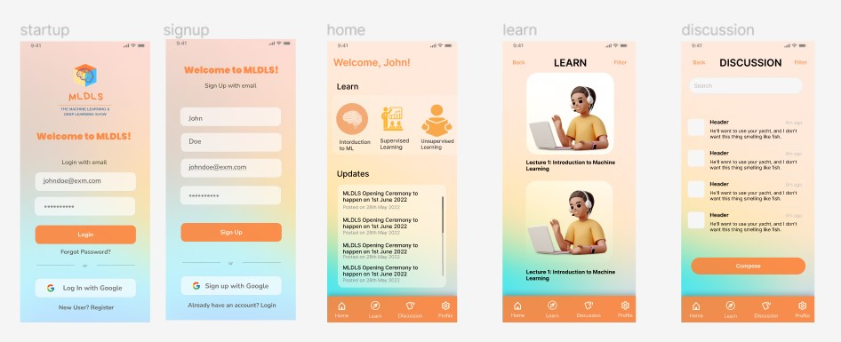

# MLDLS App - The Designing to Development Journey

I've been working on Flutter since December 2021. Additionally, I recently caught interest in Product Designing. I asked myself, "What do I do?" And the answer was "BOTH". 
This repository is all about me having hands-on with my designing skills in Figma and bringing it to life via Flutter :). 

## Destination 1 : About Project [28 May 2022]
The first thing was to think "What to design and develop?". For last few years, I along with my friends have been co-organizing a 2-week summer school on Machine Learning, namely [MLDLS](https://MLDLS.github.io). I decided to create an app for MLDLS. Such that it will have learning resources, important announcements and a forum for discussion.

## Destination 2 : Thought Design [28 May 2022]
To start with designing, I had a rough sketch in my mind. I knew that the app will consist of the following screens:
- Login Screen 
- Home Page (Quick Navigation Tools)
- Learn Page (Learning resources) 
- Discussion Page (Discussion Platform)
- Profile 

## Destination 3 : Designing via Figma Draft 1 [29 May 2022]
I start designing the UI for the above listed pages using [Figma](http://figma.com/). I created the first draft (ref below).
 

## Destination 4 : Taking Feedback [30 May 2022]
This was my first ever UI design. I knew, I must have done a lot of mistakes. I wanted to take feedback. I tweeted about it ([Tweet](https://twitter.com/Vedant_Bahel/status/1531338696037138433)) and also messaged some of my friends who are into UI/UX. 
Following are some key feedbacks that I received:
- Proper alignment and padding required 
- Text visibility can be improved 
- I should also add Signup Page
- Login button is important. It should be bigger
- Space utilization (top section besides logout button is eating a lot of space)
- Suggestion that I can use combination of two fonts
- Suggestion for better illustrations (Icon8 Plugin on Figma)

Thanks for suggestions and review to all who replied over my tweet and to those whom I reached out personally ([@0xSaurabh](https://twitter.com/0xSaurabh), [@dwvicy](https://twitter.com/dwvicy) and [@Jpandya26](https://twitter.com/Jpandya26)). 

## Destination 5 : Designing via Figma Draft 2 [31 May 2022]
After implementing the suggested changes, the designed looked as follows:
 

## Destination 6 : Coding in Flutter [2nd June 2022]
Although I believe, there will be some more iterations to my design but still I started coding the recent draft in flutter. As I improve my design, I can make the respective changes in flutter as well. 
The code for flutter app can be found in this repository in the "app" folder. 

### Sub-Destination 6.1 (In Progress)
Designing the login page

## In Progres. Come back for updates. 
